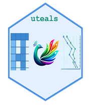
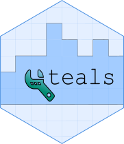
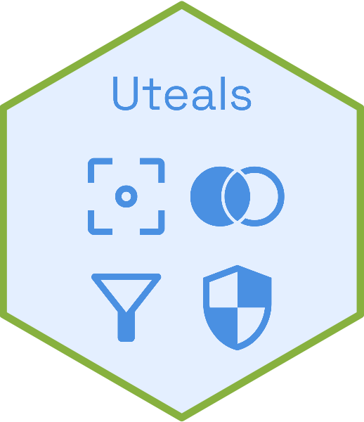
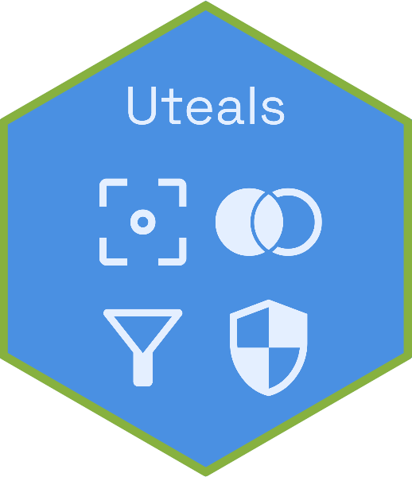

# Hexagon Design Submissions

This folder contains community-submitted hexagon designs for the uteals package.

## Submissions

### Example Entry Format:
**Filename**: `uteals_hex_example.png`  
**Designer**: Your Name  
**Concept**: Brief description of your design approach and symbolism.

---

*Add your submission details below:*

**Filename**:`uteals_hex_Nadia_Abraham.png`

 

**Designer**:Nadia Abraham

**Concept**: Blending into the Teal theme, the logo features a peacock mascot along with the clinical TLG outputs. The peacock is chosen as the bird mascot as it symbolises elegance and exquisiteness which aligns with the “uteals” package objective of adding transformators and decorators to ornately refine the data as well as aesthetically enhance the TLG outputs for superior experience.
Note: Image components created using bing image creator

---

**Filename**: `uteals_hex_alanharrison.png`  
 

**Designer**: Alan Harrison  

**Concept**: I wanted to keep a strong link to the original teal package so I used a similar gridded backdrop and colours. Taking inspiration from the design brief, I created a background of building blocks in a bar chart, then I brought in the tools element using a vector image of a spanner to form the 'U' letter of the 'Uteals' package. Overall I wanted a clean design with a recognisable link to the original teal package whilst incorporating the utilities theme.

---

**Filename**: `uteals_hex_SohanLal.png`   
 

`uteals_hex_SohanLal_1.png`  
 

`uteals_hex_SohanLal_2.png`  
 

`uteals_hex_SohanLal_3.png`  
 

`uteals_hex_SohanLal_4.png`  
 

**Designer**: Sohan Lal  

**Concept**: This design prioritises instant recognition over artistic flair. I used a universal UI language, showing a funnel filter, a shield protecting, and brackets framing. By stripping away gradients and complex shading, we ensure the sticker remains legible even at small icon sizes. It is a utilitarian badge for a utilitarian tool, simple and direct.

---